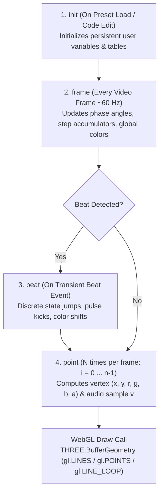

# Duperscope Component Proposal

## 1. Overview & Vision

**Duperscope** is Visualització's modern reinterpretation of the iconic **Superscope** component from Winamp AVS (Advanced Visualization Studio).

In Winamp AVS, Superscope was celebrated as the most expressive generative component: a programmable parametric curve and particle generator that evaluates user mathematical expressions at high framerates (60+ FPS) to position, animate, and color vertices based on audio waveform and frequency spectrum data.

Duperscope brings this capability into WebGL / Three.js, supporting Visualització's global expression system, coordinate conventions, and the classic 4-phase code execution lifecycle.

---

## 2. Architecture & Execution Lifecycle

Duperscope runs 4 distinct evaluation phases to balance performance, state maintenance, and per-vertex calculation:



### Execution Lifecycle Phases

| Phase | When It Executes | Typical Purpose | Frequency |
| :--- | :--- | :--- | :--- |
| **`init`** | Once when the preset loads, or when the user edits script code. | Declaring initial state variables, persistent counters, constant tables. | 1 time |
| **`frame`** | Once per render frame before drawing vertices. | Animating global rotations, calculating elapsed time offsets, updating base colors. | ~60 Hz |
| **`beat`** | Once immediately following `frame` if and only if a beat transient is detected. | Triggering beat flashes, discrete angular jumps, step-advancing animations. | Audio-driven (~1–3 Hz) |
| **`point`** | $N$ times per frame ($i = 0$ to $n - 1$). | Parametric equations for vertex coordinate $(x, y)$, color $(r, g, b, a)$, and audio displacement. | $N \times 60\text{ Hz}$ (e.g. 60–240,000 evals/sec) |

---

## 3. Coordinate System & Color Range

- **Screen Coordinates ($x, y$):** Range $[-1.0, 1.0]$ with `(0.0, 0.0)` at center.
- **Color Channels ($r, g, b, a$):** Range $[0.0, 1.0]$. `a` defaults to `1.0`.

---

## 4. Variable & Function Scope

### A. Duperscope Built-in Scope Variables

| Variable | Scope / Phase | Access | Description |
| :--- | :--- | :--- | :--- |
| `n` | `init`, `frame`, `point` | **Read / Write** in `init`, `frame`; **Read-Only** in `point` | **Total point count** (Default: 200, Range: 1 to 4096). Modifiable dynamically in `init` or `frame`. Setting `n = 1` allows drawing a single reactive dot. |
| `i` | `point` | **Read-Only** | **Normalized point index** from `0.0` to `1.0` (computed as `n > 1 ? pointIndex / (n - 1) : 0.0`). |
| `v` | `point` | **Read-Only** | **Current point audio sample** at normalized position `i` according to the selected `audio_mode` (Waveform: $[-1.0, 1.0]$, Spectrum: $[0.0, 1.0]$). Fast shorthand for `#WAVEFORM(i)` or `#FFT(i)`. |
| `x` | `point` | **Read / Write** | **Output horizontal position** $[-1.0, 1.0]$. (Initial default: `(i * 2.0) - 1.0`). |
| `y` | `point` | **Read / Write** | **Output vertical position** $[-1.0, 1.0]$. (Initial default: `0.0`). |
| `r` | `frame`, `point` | **Read / Write** | **Red color channel** $[0.0, 1.0]$. Values set in `frame` persist as the base default for all points. |
| `g` | `frame`, `point` | **Read / Write** | **Green color channel** $[0.0, 1.0]$. Values set in `frame` persist as the base default for all points. |
| `b` | `frame`, `point` | **Read / Write** | **Blue color channel** $[0.0, 1.0]$. Values set in `frame` persist as the base default for all points. |
| `a` | `frame`, `point` | **Read / Write** | **Alpha transparency** $[0.0, 1.0]$ (Default: `1.0`). Values set in `frame` persist as base default. |
| `linesize` | `frame`, `point` | **Read / Write** | **Line stroke width / particle point size** (Default: `1.0`). |

### B. User-Defined Persistent State
Custom variables assigned in `init`, `frame`, or `beat` (e.g. `rot = rot + 0.02;`, `phase`, `zoom`) automatically persist across frames on the component instance's state context.

### C. System Variables, Functions & Math
- All standard Visualització system variables (`$VARIABLE`) and functions (`#FUNCTION(...)`) can be referenced in any code block.
- **Audio Function Synergy:**
  - `v` is a convenient zero-overhead shorthand automatically bound to the point's index `i` based on the component's `audio_mode`.
  - For advanced multi-band sampling within the same script, scripts can also call `#FFT(position, bandwidth, channel)` or `#WAVEFORM(position, channel)` anywhere in `frame` or `point`.

---

## 5. Audio Source Configuration

Duperscope allows selecting the primary audio stream sampled by the automatic `v` variable:

1. **Audio Mode (`audio_mode`):**
   - `Waveform` (Time-domain oscilloscope data): $v \in [-1.0, 1.0]$.
   - `Spectrum` (Frequency-domain FFT data): $v \in [0.0, 1.0]$.
2. **Audio Channel (`channel`):**
   - `Center` (Mono mixdown: $(L + R) / 2$)
   - `Left` ($L$ channel only)
   - `Right` ($R$ channel only)

---

## 6. Rendering & Geometry Modes

Duperscope translates evaluated points directly into a dynamic `THREE.BufferGeometry`:

| Draw Mode (`draw_mode`) | WebGL Primitive | Visual Appearance |
| :--- | :--- | :--- |
| `Lines` (Default) | `gl.LINE_STRIP` | Continuous connected line strip through points $0 \dots n-1$. |
| `Points` | `gl.POINTS` | Discrete particles / dots at each point. Size controlled by `linesize`. When `n = 1`, renders a single controllable particle. |
| `Line Loop` | `gl.LINE_LOOP` | Closed continuous polyline automatically connecting point $n-1$ back to point $0$. |

### WebGL Implementation Strategy
- A dedicated `THREE.BufferGeometry` stores pre-allocated `position` (`Float32Array(max_points * 3)`) and `color` (`Float32Array(max_points * 4)`) attributes.
- On each frame, the evaluated $(x, y, 0)$ and $(r, g, b, a)$ buffer slices are marked `needsUpdate = true` and `drawRange.count = n`.
- Rendered using an unlit vertex-colored shader or `THREE.LineBasicMaterial` / `THREE.PointsMaterial` with premultiplied or additive blending.

---

## 7. Component Preset Schema (JSON)

```json
{
  "id": "duperscope-1",
  "name": "Duperscope",
  "type": "Duperscope",
  "enabled": true,
  "config": {
    "points": 400,
    "audio_mode": "Waveform",
    "channel": "Center",
    "draw_mode": "Lines",
    "code": {
      "init": "n = 400; rot = 0; zoom = 1.0;",
      "frame": "rot = rot + 0.01 + ($BASS * 0.03); r = 0.2 + ($BASS * 0.8); g = 0.5; b = 1.0;",
      "beat": "zoom = 1.3;",
      "point": "zoom = zoom + (1.0 - zoom) * 0.05;\nrad = i * PI * 2;\ndist = (0.5 + v * 0.3) * zoom;\nx = cos(rad + rot) * dist;\ny = sin(rad + rot) * dist;"
    }
  }
}
```

---

## 8. Classic Example Presets

### Example A: Oscilloscope Tunnel (Circular Reactive Waveform)
- **Audio Mode:** `Waveform`
- **Draw Mode:** `Line Loop`
```js
// init
n = 360;
angle = 0;

// frame
angle = angle + 0.015;
r = 0.1 + $TREBLE * 0.9;
g = 0.7;
b = 1.0;

// beat
angle = angle + 0.1;

// point
theta = i * 2 * PI;
radius = 0.5 + (v * 0.25) + ($BASS * 0.15);
x = cos(theta + angle) * radius;
y = sin(theta + angle) * radius;
```

### Example B: Frequency Spectrum Bar Line
- **Audio Mode:** `Spectrum`
- **Draw Mode:** `Lines`
```js
// init
n = 256;

// frame
r = 1.0;
g = 0.2 + $MID * 0.8;
b = 0.1;

// beat
// (none)

// point
x = (i * 2.0) - 1.0;
y = -0.5 + (v * 1.2);
```

### Example C: Reactive Lissajous Figure
- **Audio Mode:** `Waveform`
- **Draw Mode:** `Lines`
```js
// init
n = 500;
t = 0;

// frame
t = t + 0.02 + ($BASS * 0.02);
r = sin(t) * 0.5 + 0.5;
g = cos(t) * 0.5 + 0.5;
b = 0.8;

// beat
t = t + 0.2;

// point
w = i * 2 * PI;
x = sin(w * 3 + t) * (0.7 + v * 0.2);
y = cos(w * 2 + t * 1.5) * (0.7 + v * 0.2);
```

### Example D: Single Audio-Reactive Beat Particle
- **Audio Mode:** `Waveform`
- **Draw Mode:** `Points`
```js
// init
n = 1;
linesize = 12.0;

// frame
r = 1.0;
g = $BASS;
b = 0.2;

// beat
linesize = 30.0;

// point
linesize = linesize + (8.0 - linesize) * 0.1;
x = $BASS * 0.4 * cos($TIME * 3);
y = $BASS * 0.4 * sin($TIME * 3);
```

---

## 9. Evaluation Engine & Safety
- **Compilation:** User code blocks (`init`, `frame`, `beat`, `point`) are parsed via the `ExpressionPreprocessor` and compiled into optimized JavaScript functions.
- **Safety Sandboxing:** Code blocks run in a restricted execution context where global `window`, `document`, and network primitives are inaccessible.
- **Error Handling:** If a syntax error or runtime error occurs in any block, the component enters an error state, flags the invalid line in the inspector UI, and gracefully bypasses point rendering without terminating the WebGL engine loop.
