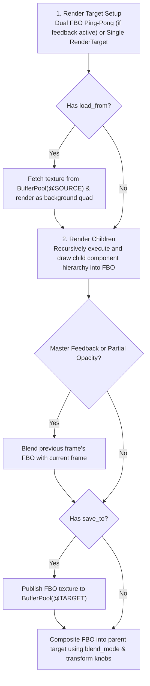

# Frame Buffer Component Proposal

## 1. Overview & Vision

The **Frame Buffer** component is Visualització's foundational container, render-to-texture mechanism, and compositing layer. Inspired by Winamp AVS's nested render lists and render-to-texture buffers, it serves three critical architectural roles:

1. **Modular Container:** Encloses child visual components or nested child buffers, rendering them into an isolated offscreen `THREE.WebGLRenderTarget`.
2. **Master Frame Buffer Root:** Serves as the permanent, non-deletable root node of every preset pipeline (`is_master: true`), governing whether each frame starts with a clean slate or generates analog motion decay through feedback loops.
3. **Named Buffer Producer & Consumer:** Produces named textures (`save_to="@BUFFER_NAME"`) and samples upstream textures (`load_from="@BUFFER_NAME"`), enabling complex multi-pass effects such as multi-quad screen replication, PIP, and cross-channel feedback echoes.

---

## 2. Architecture & Execution Lifecycle

The Frame Buffer operates across two operational phases in the render loop:



### Execution Lifecycle Phases

| Phase | When It Executes | Typical Purpose | Frequency |
| :--- | :--- | :--- | :--- |
| **`setup`** | On preset load or canvas resize. | Allocates offscreen WebGL render targets matching canvas dimensions (with pixel ratio scaling). Allocates dual ping-pong buffers if feedback blend modes or partial opacity are configured. | Lifecycle event |
| **`pre-render`** | Beginning of frame for this buffer. | If `load_from="@NAME"` is configured, retrieves the referenced texture from the global `BufferPool` and renders it onto a background quad. If `is_master: true` and `blend_mode: "Replace"`, clears the screen to clean slate. | ~60 Hz |
| **`child-render`** | Middle of frame. | Traverses and executes all child visual components and nested buffers sequentially inside this buffer's render target. | ~60 Hz |
| **`post-render`** | End of frame for this buffer. | If `save_to="@NAME"` is configured, publishes the completed render target texture to `BufferPool`. If ping-pong feedback is active, swaps read/write buffers. Composites final quad into parent target. | ~60 Hz |

---

## 3. Coordinate System & Transform Modulation

The Frame Buffer exposes top-level modulation parameters that transform its entire rendered contents before compositing into its parent target:

- **Position X (`positionX`):** Horizontal translation in $[-1.0, 1.0]$ (`-1.0` = left edge, `1.0` = right edge, `0.0` = center).
- **Position Y (`positionY`):** Vertical translation in $[-1.0, 1.0]$ (`-1.0` = bottom edge, `1.0` = top edge, `0.0` = center).
- **Scale (`scale`):** Uniform zoom/scale factor (Default: `1.0`).
- **Rotation (`rotation`):** Rotation angle in radians (Default: `0.0`).
- **Opacity (`opacity`):** Layer opacity in $[0.0, 1.0]$ (Default: `1.0`).

All transform parameters can be set to static literal values or dynamically bound to formulas using Visualització's expression engine.

---

## 4. Master Frame Buffer & Feedback Loop

Every preset hierarchy is rooted in a single Master Frame Buffer (`is_master: true`).

### Clean Slate vs. Frame Feedback
The Master Frame Buffer's blend mode and opacity govern canvas persistence:
- **Clean Slate (`Replace`, Opacity = 1.0):** Clears the canvas buffer at the start of every frame. Visuals render crisp with zero persistence.
- **Feedback Loop (Feedback Blend Modes or Opacity < 1.0):** Activates dual-FBO ping-pong buffers. At the start of frame $T$, the completed output of frame $T-1$ is blended into the canvas before new elements are drawn, creating classic motion trails, phosphor decay, and infinite feedback zooms.

---

## 5. Named Buffer Routing (`save_to` & `load_from`)

Frame buffers can decouple from strict tree hierarchies by publishing and consuming named textures:

- **Buffer Production (`save_to="@BUFFER_NAME"`):** Publishes the buffer's rendered output into the global `BufferPool`.
- **Buffer Consumption (`load_from="@BUFFER_NAME"`):** Injects the upstream named buffer as a texture source before rendering children.
- **Cycle Prevention & Error Handling:** If a circular dependency (e.g. `@BUFFER_A` loading `@BUFFER_B` while `@BUFFER_B` loads `@BUFFER_A`) or missing buffer is detected, the dependent buffer is automatically disabled, displayed with an error state badge in the UI, and logged to the diagnostics console.

---

## 6. Blend Modes

Supports 6 distinct WebGL compositing blend modes:

| Blend Mode | Math Operation | Visual Description |
| :--- | :--- | :--- |
| **`Replace`** | $C_{out} = C_{src}$ | Completely overwrites underlying pixels. Clean slate default. |
| **`Additive`** | $C_{out} = \min(1, C_{dst} + C_{src})$ | Adds color channels. Bright spots glow and overexpose; black areas remain transparent. |
| **`Maximum`** | $C_{out} = \max(C_{dst}, C_{src})$ | Takes the highest channel value between source and destination. |
| **`Minimum`** | $C_{out} = \min(C_{dst}, C_{src})$ | Takes the lowest channel value between source and destination. |
| **`Subtractive`** | $C_{out} = \max(0, C_{dst} - C_{src})$ | Inverts and subtracts top layer brightness from background. |
| **`Multiplicative`**| $C_{out} = C_{dst} \times C_{src}$ | Multiplies color channels. Produces shading, tinting, and darkening. |

---

## 7. Component Preset Schema (JSON)

```json
{
  "id": "frame-buffer-1",
  "name": "Master Frame Buffer",
  "type": "frame_buffer",
  "enabled": true,
  "is_master": true,
  "parameters": {
    "blend_mode": { "mode": "fixed", "value": "replace" },
    "clear_color": { "mode": "fixed", "value": "#000000" },
    "opacity": { "mode": "fixed", "value": 1.0 },
    "scale": { "mode": "fixed", "value": 1.0 },
    "rotation": { "mode": "fixed", "value": 0.0 },
    "positionX": { "mode": "fixed", "value": 0.0 },
    "positionY": { "mode": "fixed", "value": 0.0 },
    "save_to": { "mode": "fixed", "value": null },
    "load_from": { "mode": "fixed", "value": null }
  },
  "children": []
}
```

---

## 8. Classic Example Presets

### Example A: 4-Corner Scaled Replication
A master scene renders a visual element into `@BUFFER_A`, and four child buffers sample `@BUFFER_A` scaled down to 50% and positioned in each screen corner:

```json
{
  "id": "master-root",
  "name": "Master Frame Buffer",
  "type": "frame_buffer",
  "enabled": true,
  "is_master": true,
  "parameters": {
    "blend_mode": { "mode": "fixed", "value": "replace" },
    "clear_color": { "mode": "fixed", "value": "#000000" },
    "opacity": { "mode": "fixed", "value": 1.0 }
  },
  "children": [
    {
      "id": "buf-source",
      "name": "Generator Buffer",
      "type": "frame_buffer",
      "enabled": true,
      "parameters": {
        "save_to": { "mode": "fixed", "value": "@BUFFER_A" },
        "opacity": { "mode": "fixed", "value": 0.0 }
      },
      "children": [ /* Visual generator child */ ]
    },
    {
      "id": "corner-tl",
      "type": "frame_buffer",
      "parameters": {
        "load_from": { "mode": "fixed", "value": "@BUFFER_A" },
        "scale": { "mode": "fixed", "value": 0.5 },
        "positionX": { "mode": "fixed", "value": -0.5 },
        "positionY": { "mode": "fixed", "value": 0.5 }
      }
    },
    {
      "id": "corner-tr",
      "type": "frame_buffer",
      "parameters": {
        "load_from": { "mode": "fixed", "value": "@BUFFER_A" },
        "scale": { "mode": "fixed", "value": 0.5 },
        "positionX": { "mode": "fixed", "value": 0.5 },
        "positionY": { "mode": "fixed", "value": 0.5 }
      }
    },
    {
      "id": "corner-bl",
      "type": "frame_buffer",
      "parameters": {
        "load_from": { "mode": "fixed", "value": "@BUFFER_A" },
        "scale": { "mode": "fixed", "value": 0.5 },
        "positionX": { "mode": "fixed", "value": -0.5 },
        "positionY": { "mode": "fixed", "value": -0.5 }
      }
    },
    {
      "id": "corner-br",
      "type": "frame_buffer",
      "parameters": {
        "load_from": { "mode": "fixed", "value": "@BUFFER_A" },
        "scale": { "mode": "fixed", "value": 0.5 },
        "positionX": { "mode": "fixed", "value": 0.5 },
        "positionY": { "mode": "fixed", "value": -0.5 }
      }
    }
  ]
}
```

### Example B: Beat-Reactive Infinite Feedback Tunnel
Master Frame Buffer uses `additive` blend mode with slight decay and scale modulation to create a vortex trail:

```json
{
  "id": "master-root",
  "name": "Master Frame Buffer",
  "type": "frame_buffer",
  "enabled": true,
  "is_master": true,
  "parameters": {
    "blend_mode": { "mode": "fixed", "value": "additive" },
    "opacity": { "mode": "expression", "value": "0.92 - ($BASS * 0.05)" },
    "scale": { "mode": "expression", "value": "1.02 + ($BASS * 0.02)" },
    "rotation": { "mode": "expression", "value": "0.01" }
  },
  "children": []
}
```
