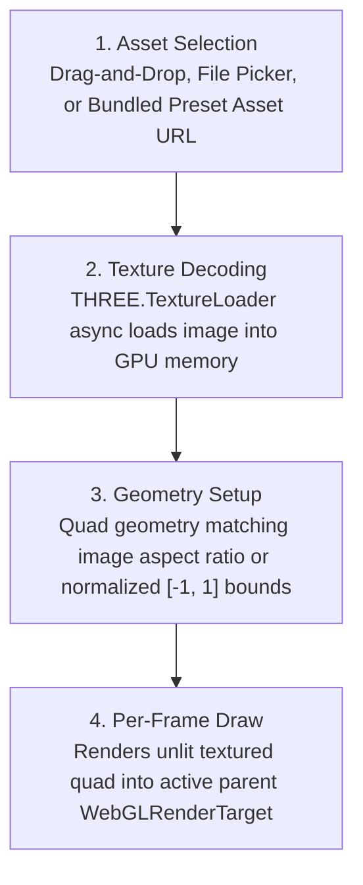

# Static Image Component Proposal

## 1. Overview & Vision

The **Static Image** component is Visualització's foundational 2D texture asset loader. It provides visual presets with baseline photographic, graphic, or logo textures that can be animated, echoed, and composited using parent Frame Buffer containers or downstream shaders.

In Visualització's architecture, the Static Image component is intentionally kept lightweight and focused solely on asset retrieval and texture preparation: all spatial transformations (scale, translation, rotation) and compositing (blend modes, opacity) are delegated to the enclosing **Frame Buffer** container.

---

## 2. Architecture & Execution Lifecycle



### Execution Lifecycle Phases

| Phase | When It Executes | Typical Purpose | Frequency |
| :--- | :--- | :--- | :--- |
| **`load`** | On preset load, drag-and-drop, or asset file selection. | Asynchronously decodes image file into a `THREE.Texture` with linear filtering and clamp-to-edge wrapping. | Once on selection |
| **`frame`** | Every render frame within parent container. | Binds the texture and renders a fullscreen/aspect-fitted quad into the parent target. | ~60 Hz |

---

## 3. Aspect Ratio & Texture Filtering

| Property | Options | Description |
| :--- | :--- | :--- |
| **`fit_mode`** | `Contain`, `Cover`, `Stretch` | How the image fits within the $[-1.0, 1.0]$ bounds. `Cover` preserves aspect ratio filling screen, `Contain` preserves aspect ratio letterboxing, `Stretch` fits exact square. |
| **`filter`** | `Linear`, `Nearest` | Texture sampling filter (`Linear` for smooth photographic scaling, `Nearest` for crisp pixel art). |

---

## 4. Component Preset Schema (JSON)

```json
{
  "id": "image-1",
  "name": "Static Image",
  "type": "StaticImage",
  "enabled": true,
  "config": {
    "source_url": "/assets/default_graphic.png",
    "fit_mode": "Cover",
    "filter": "Linear"
  }
}
```

---

## 5. Classic Example Presets

### Example: Image Inside a Reactive Frame Buffer
Static Image nested inside a Frame Buffer that scales with the beat:

```json
{
  "id": "fb-image-container",
  "name": "Pulsing Image",
  "type": "FrameBuffer",
  "enabled": true,
  "config": {
    "blend_mode": "Additive",
    "scale": { "mode": "expression", "value": "1.0 + #BEAT(0.2) * 0.3" },
    "opacity": { "mode": "expression", "value": "0.8 + ($BASS * 0.2)" }
  },
  "children": [
    {
      "id": "img-smiley",
      "name": "Smiley Graphic",
      "type": "StaticImage",
      "enabled": true,
      "config": {
        "source_url": "/assets/smiley.png",
        "fit_mode": "Contain",
        "filter": "Linear"
      }
    }
  ]
}
```
